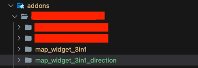
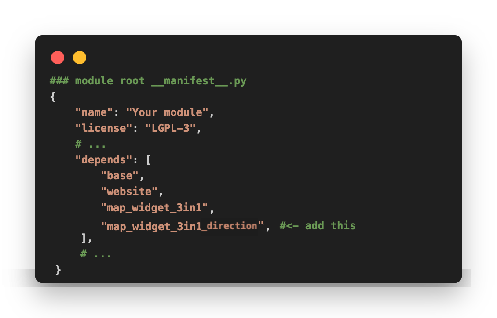
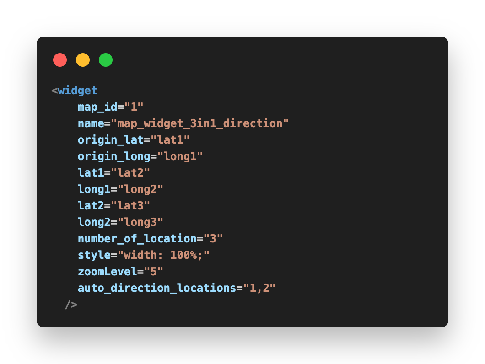
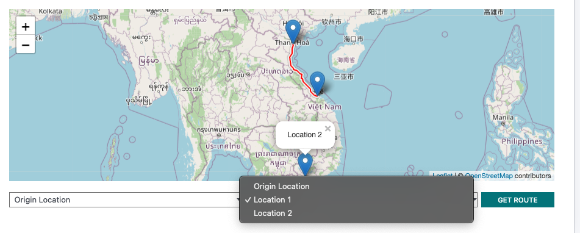
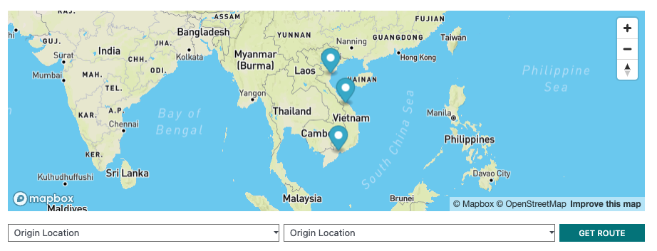
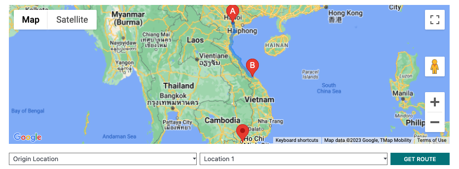

# :world_map: Map Widget (3 in 1) Direction - Odoo V16

### Easy Map Widget with direction feature integration.
<b>:rotating_light:Noticed: </b> For using this direction feature, you need to integrate <b>[map_widget_3in1](https://developers.google.com/maps/documentation/javascript/get-api-key)</b> addon first.

## Demo

## Installation

1. Put the <b>'map_widget_3in1_direction'</b> add-ons into your Odoo source code (same folder contain <b>map_widget_3in1</b>)

	
 
2. Three options are prioritised as listed below. 

	#### :pushpin: Mapbox
	**a.1.** If you want to display Mapbox, you need to register [Map Box](https://www.mapbox.com)'s API KEY 
	**a.2.** Enter the Mapbox API KEY into **Setting**. And if you enter the Mapbox's API KEY, the map widget will always choose Mapbox to display first.

	

	#### :pushpin: Open Street Map
	**b.1.** If you want to display Street Map, just leave the Mapbox API KEY blank and tick into the **Geo Localization** option. 
	**b.2.** Make sure **Geo Localization** API's option is **Open Street Map**

	

	#### :pushpin: Google Map
	**c.1.** If you want to display Google Map, config following **b.1 step**.  
	**c.2.** Make sure **Geo Localization** API's option is **Google Place Map**, and do not forget adding [Google API KEY](https://developers.google.com/maps/documentation/javascript/get-api-key)
	
    

3. Add <b>'map_widget_3in1_direction'</b> addons into your module depend you want to add map.

## Usage Example
#### To add widget map direction, you need to have more than 2 of locations ([read properties section - create dynamic location in map_widget_3in1](https://developers.google.com/maps/documentation/javascript/get-api-key))

We have 2 of ways to direction form first location to second location. 

<b>1. Auto direction (static direction)</b> 
Everything you need to do is add values for <b>auto_direction_locations</b>, the map will always drirect from A to B following location index values without controller. The values is string with 2 of location's index. 
<b>Example:</b> 
auto_direction_locations="0,1" (direction from original location to location1) 
auto_direction_locations="0,2" (direction from original location to location2) 
auto_direction_locations="1,2" (direction from location1 to location2) 

<b>2. Direction with controller </b> 
Just remove <b>auto_direction_locations</b> properties. We can using dynamic direction with controller UI.

## Properties
This <b>map_widget_3in1_direction</b> addons have common properties with <b>map_widget_3in1</b>, so you can read detail addons's properties <b>[here](https://developers.google.com/maps/documentation/javascript/get-api-key)</b>
| Function name  | Description               | Example value |
| --------------------- | ------------------------------|----------------------|
|auto_direction_locations    |  Static direction from location index A to location index B  | **(string)** ex: "0,1", "0,2", "1,2"...   |

## Credits & Support
- vietnguyenhoangw <[vietnguyenhoangw@gmail.com](vietnguyenhoangw@gmail.com)>
- Vu Nguyen Anh <[vuna2004@gmail.com](vuna2004@gmail.com)>
